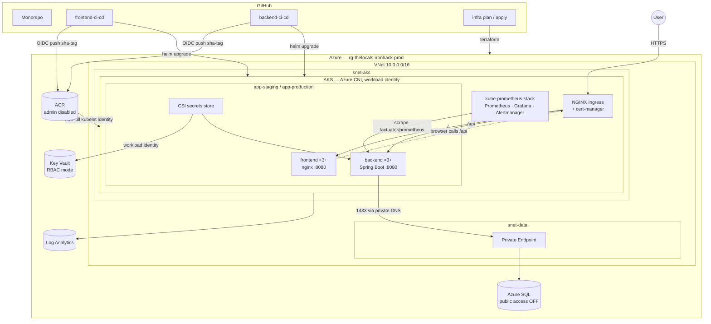

# Architecture

A 3-tier application (React SPA → Spring Boot API → Azure SQL) on AKS, with the
application layer kept deliberately thin and swappable: the product of this
repo is the platform — infrastructure as code, two independent CI/CD pipelines,
observability, and security. Swapping in a real product changes `apps/` only
(see [The swappable-app contract](#the-swappable-app-contract)).

## System diagram

## Request path

1. Browser hits the NGINX ingress over TLS (cert-manager / Let's Encrypt).
2. `/` serves the SPA from the frontend pods; the SPA reads its API base URL
   from runtime `env.js` (empty = same origin).
3. The SPA calls `/api/items`; the same ingress routes `/api` to the backend
   Service — the backend is never exposed except through this path.
4. The backend reaches Azure SQL on 1433 through the private endpoint;
   `privatelink.database.windows.net` resolves to a private IP inside the VNet.

## Decisions and the alternatives we rejected

Each decision has a full ADR in `docs/adr/`; this is the summary.

### NGINX Ingress + cert-manager, not AGIC ([ADR-0001](adr/0001-nginx-ingress-over-agic.md))
NGINX is cloud-portable, community-standard, fast to iterate on (annotations,
canary, rewrites), and cert-manager automates TLS end to end. AGIC would buy a
managed L7 with **WAF** — the right call for a compliance-driven production
system — at the cost of Azure lock-in, slower reconciliation, and a second
config surface (App Gateway) outside the cluster. For this platform, WAF is the
only thing we give up, and we document it as the upgrade path.

### System/user node pool split ([ADR-0002](adr/0002-node-pool-split.md))
The system pool is tainted `CriticalAddonsOnly` and runs only cluster-critical
components; all workloads (`nodeSelector: workload=apps`) land on the user
pool. A noisy app (exactly what the k6 test creates on purpose) can exhaust
user-pool nodes without starving CoreDNS/metrics-server. Both pools autoscale
independently with explicit min/max. Rejected: one shared pool — cheaper, but a
load spike can degrade the control plane's cluster-critical addons.

### Azure SQL behind a private endpoint ([ADR-0003](adr/0003-sql-private-endpoint.md))
`public_network_access_enabled = false`; the only path is the private endpoint
in `snet-data` + private DNS. Rejected: firewall rules / "allow Azure
services" — leaves a public listener and depends on IP hygiene. Trade-off:
schema tooling must run from inside the network (documented in the runbook).

### OIDC everywhere, RO/RW split ([ADR-0004](adr/0004-oidc-identity-split.md))
Three federated identities, zero stored credentials: PRs plan with **Reader**;
apply runs as **Contributor + RBAC Administrator** but its federated credential
only matches the reviewer-gated `production` environment — an attacker who can
open PRs can *see* a plan, never apply one. App CI can push images and deploy,
nothing more. Rejected: a single service principal with a client secret in
GitHub secrets — one leaked value = full control, plus rotation toil.

### Immutable `sha-<gitsha>` image tags ([ADR-0005](adr/0005-immutable-image-tags.md))
Deploys pin the exact commit's image; rollback is `helm rollback` (or redeploy
the previous sha) with no registry-side ambiguity. `:main` exists as a
convenience alias and is never deployed. Rejected: deploying `:latest`/`:main`
— irreproducible, breaks rollback semantics, defeats scan provenance.

### Resource group created in bootstrap, not Terraform ([ADR-0006](adr/0006-rg-in-bootstrap.md))
CI roles are least-privilege *scoped to the RG*, and an RBAC scope must exist
before roles can be granted on it. So Phase 0 creates the RG; Terraform
consumes it as a data source and owns everything inside. Rejected:
subscription-scoped grants (blast radius) and Terraform-managed RG with
import gymnastics.

### Runtime `env.js`, not build-time `VITE_*` baking ([ADR-0007](adr/0007-runtime-env-js.md))
The container entrypoint writes `env.js` from the `VITE_API_URL` env var at
start, so **one image** promotes staging → production. Rejected: baking the URL
at build time — would force environment-specific images and break the
immutable-tag promotion model.

## The swappable-app contract

| Contract point | Value |
| -------------- | ----- |
| Backend port / probes | 8080 · `/actuator/health/liveness` · `/actuator/health/readiness` · `/actuator/prometheus` |
| Demo endpoint | `GET /api/items` (seeded JSON, cacheable — the load-test target) |
| DB config | `SPRING_DATASOURCE_URL/USERNAME/PASSWORD` env vars ← CSI-synced Key Vault secrets |
| Frontend | nginx :8080, runtime `env.js` (`VITE_API_URL`), `/healthz` |
| Images | `<acr>/backend:sha-<gitsha>`, `<acr>/frontend:sha-<gitsha>` |

Swapping the product = replace app code, keep the endpoints/env names, push —
CI rebuilds, rescans, and redeploys by bumping `image.tag`. Terraform, Helm
plumbing, workflows, dashboards, and alerts all stay untouched.

## Environments

One cluster, two namespaces (`app-staging`, `app-production`) with identical
charts and separate values. Every main-branch build deploys to staging
automatically; production requires a human approval on the GitHub `production`
environment. Namespace-per-env on one cluster is a deliberate cost/complexity
trade-off for a capstone; the same pipelines pointed at a second cluster give
hard isolation later.
